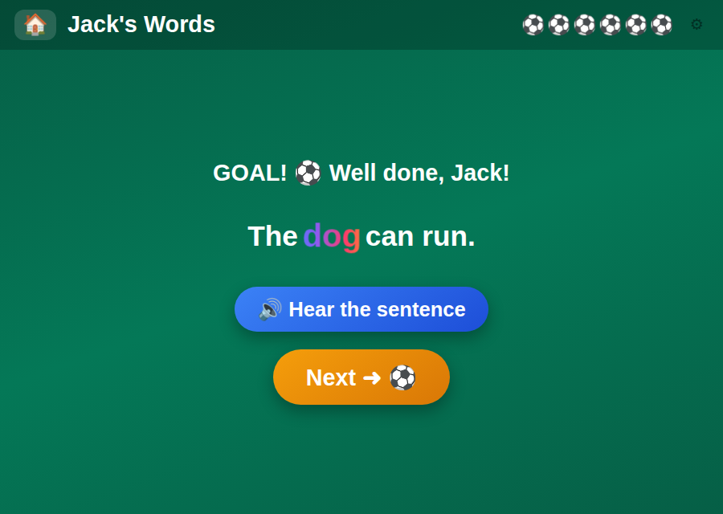

# 📖 Jack's Words

**Hear a word, build it from letter tiles, then read it in a sentence**

[](https://jacks-games.github.io/words/)




## What this is

A reading game for a child who is just starting to read — roughly Reception to Year 1, ages 5
to 7. It works one word at a time through the same three steps a teacher would use: **hear the
word, build it from its letters, then meet it inside a real sentence.** Twenty-eight words in
three levels, from `cat` to `teacher`, each with its own sentence.

It is built for a specific six-year-old who is football-mad, so the reward for every finished
word is a football. That is the whole economy: no lives, no timer, no way to lose.

## 🎮 How to play

### 1️⃣ &nbsp; Listen 🔊
Tap the blue button. A voice says the word.

### 2️⃣ &nbsp; Build it 🧩
Tap the letters in the right order. Tap a letter to hear its sound on its own.

### 3️⃣ &nbsp; Read it 🌈
The finished word lights up inside a sentence. Tap the sentence to hear all of it.

### ⚽ &nbsp; GOAL!
Every word wins a football. They line up along the top and stay there next time.

## 🔤 The word list

|  |  |
|---|---|
| 🐱 **Level 1** — 3 letters | cat · dog · sun · mum · dad · pen · red · bag · hat · bus |
| 📗 **Level 2** — 4 letters | book · ball · blue · play · milk · frog · fish · star · jump · cake |
| 🏫 **Level 3** — 5 to 7 | green · happy · water · lunch · apple · school · friend · teacher |

## 🎯 What it practises

- 👂 &nbsp; Hearing the separate sounds inside a spoken word
- 🔡 &nbsp; Matching each sound to its letter
- 📖 &nbsp; Carrying a known word into connected text

## ⚙️ Notable details

- A **phonics setting** switches letter *sounds* (`buh`, `sss`) for letter *names* (`bee`,
  `ess`), matching how English primary schools teach it.
- The target word stays visible as a faint ghost behind the empty slots, so building it is
  supported rather than a memory test.
- Wrong tiles wobble and nothing is lost — there is no failure state anywhere in the game.

## 🎈 The other games

| Game | What it is | |
|---|---|---|
| 🔟 [**Jack's Ten Frames**](https://github.com/jacks-games/ten-frames) | See numbers in fives, make ten, then add past ten on ten frames | [▶ play](https://jacks-games.github.io/ten-frames/) |
| ⏰ [**Jack's Clock**](https://github.com/jacks-games/clock) | Read the clock and set the hands — o'clock, half past, quarter past, quarter to | [▶ play](https://jacks-games.github.io/clock/) |
| 💯 [**Jack's Big Numbers**](https://github.com/jacks-games/big-numbers) | Tens and ones, adding and taking away all the way to 100 | [▶ play](https://jacks-games.github.io/big-numbers/) |
| 👀 [**Jack's Sight Words**](https://github.com/jacks-games/sight-words) | The twenty most common English words on big cards — tap one and hear it read out | [▶ play](https://jacks-games.github.io/sight-words/) |
| 🍎 [**Jack's Apples**](https://github.com/jacks-games/apples) | Trace 1–20, then fill the missing numbers into the apple grid | [▶ play](https://jacks-games.github.io/apples/) |
| 🥅 [**Jack's Match**](https://github.com/jacks-games/match) | Tell real words from decodable nonsense words, then spell by ear | [▶ play](https://jacks-games.github.io/match/) |
| ✏️ [**Jack's Letters**](https://github.com/jacks-games/letters) | Finger-trace all 26 lowercase letters in the correct stroke order | [▶ play](https://jacks-games.github.io/letters/) |
| 🔢 [**Jack's Numbers**](https://github.com/jacks-games/numbers) | Count, add and subtract with footballs — to 10, then to 20 | [▶ play](https://jacks-games.github.io/numbers/) |
| 📖 [**Jack's Words**](https://github.com/jacks-games/words) | Hear a word, build it from letter tiles, then read it in a sentence | [▶ play](https://jacks-games.github.io/words/)  👈 **this one** |
| ♟️ [**Jackies Schach**](https://github.com/jacks-games/chess) | Full FIDE rules with a coach that marks the safe squares (German) | [▶ play](https://jacks-games.github.io/chess/) |

All ten on one start page: **[jackbenn.ing](https://jackbenn.ing)** — newest first, homework on top, chess always last.

## 🛠 Built like this

Every game in this organisation is **one self-contained `index.html`** — no build step, no
framework, no package manager, no analytics, and no network calls beyond its own voice clips (chess also loads its rules engine, chess.js, from
jsDelivr, and Sight Words its font from Google Fonts).
That is a deliberate constraint: a game a child depends on should still work in five years,
and a parent should be able to read the whole thing in one sitting.

- **Speech** — pre-rendered clips of the neural `en-GB-SoniaNeural` voice, played through Web Audio,
  with the Web Speech API as the fallback. The `AudioContext` is created inside the ▶ tap,
  because iOS refuses to start audio any other way.
- **Progress** — kept in `localStorage` on the device. Nothing is collected, sent or stored
  anywhere else.
- **Made for** an iPad mini in either orientation: finger-sized targets, no hover-only
  interactions, `prefers-reduced-motion` respected.

Run it locally:

```bash
python3 -m http.server 8000
```

The start page at [jackbenn.ing](https://jackbenn.ing) is built from
[google814/Jack](https://github.com/google814/Jack), which is the source of truth. The repos
in this organisation are copies kept in step by `tools/sync-game-repos.sh` in that repo, so
each game also has its own page and its own link.
